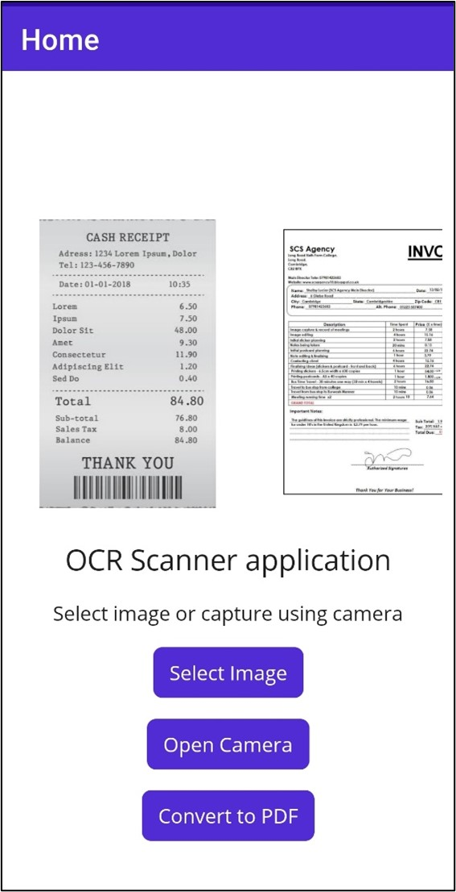
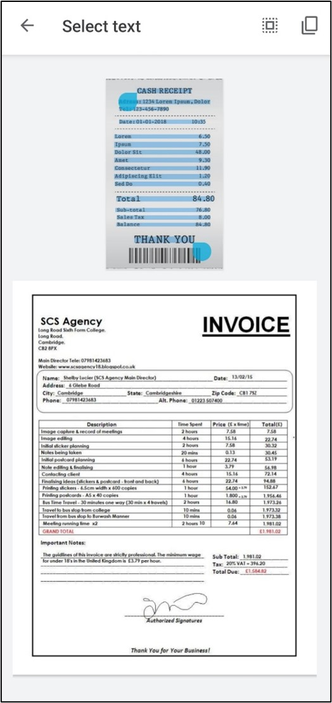

# OCR in .NET MAUI: Building an Image Processing Application

The [Syncfusion&reg; .NET MAUI library](https://www.syncfusion.com/document-processing/pdf-framework/maui/pdf-library) is used to create, read, and edit PDF documents. This repository contains the example of .NET MAUI OCR scanner application to scan images using OCR scanner and convert them to PDF document with searchable text using the [Syncfusion&reg; OCR library](https://www.syncfusion.com/document-processing/pdf-framework/net/pdf-library/ocr-process).   

## Steps to build an OCR scanner application in .NET MAUI
### Step 1: Download the project
Download this project to a location in your disk. Then open the solution file using Visual Studio. 

### Step 2: Rebuild solution
Rebuild the solution to install the required NuGet package. 

### Step 3: Add UI elements
In this application, we get images from the user in the following ways:
* Open the camera and capture images such as receipts, notes, documents, photos, and business cards.
* Select images from the device's photo gallery.

**Open camera and capture image**

Add a button in the UI to open the camera.

```csharp

<Button x:Name="CameraBtn"
	  Text="Open Camera"
          Clicked="OnCameraClicked"
          HorizontalOptions="Center" />

```

Use the MAUI [MediaPicker](https://learn.microsoft.com/en-us/dotnet/maui/platform-integration/device-media/picker) API to open and capture images using the camera. The MediaPicker API needs permission to access the camera and internal storage. Refer to the [get started](https://learn.microsoft.com/en-us/dotnet/maui/platform-integration/device-media/picker?view=net-maui-7.0&tabs=android#get-started) section of the API documentation to set the permissions.

Call the CapturePhotoAsync method to open the camera and capture the image. Refer to the following code example which is implemented in in [MainPage.xaml.cs](OCRScanner/MainPage.xaml.cs) file. 

```csharp

private void OnCameraClicked(object sender, EventArgs e)
{
   TakePhoto();
}
//Open camera and take photo
public async void TakePhoto()
{
   if (MediaPicker.Default.IsCaptureSupported)
   {
      FileResult photo = await MediaPicker.Default.CapturePhotoAsync();
      if (photo != null)
      {
          // Save the file into local storage.
          string localFilePath = Path.Combine(FileSystem.CacheDirectory, photo.FileName);
                
          //Reduce the size of the image. 
          using Stream sourceStream = await photo.OpenReadAsync();
          using SKBitmap sourceBitmap=SKBitmap.Decode(sourceStream);
          int height = Math.Min(794, sourceBitmap.Height);
                int width = Math.Min(794, sourceBitmap.Width);
                
          using SKBitmap scaledBitmap = sourceBitmap.Resize(new SKImageInfo(width, height),SKFilterQuality.Medium);
          using SKImage scaledImage = SKImage.FromBitmap(scaledBitmap);
                
          using (SKData data = scaledImage.Encode())
          {
              File.WriteAllBytes(localFilePath, data.ToArray());
          }
               
           //Create model and add to the collection
           ImageModel model = new ImageModel() { ImagePath = localFilePath, Title = "sample", Description = "Cool" };
           viewModel.Items.Add(model);
      }
   }
}

```

**Select an image from the gallery** 

Add a button in the UI to select an image.

```csharp 

<Button
	x:Name="CounterBtn"
	Text="Select Image"
	Clicked="OnCounterClicked"
	HorizontalOptions="Center" />

``` 

Use the MAUI MediaPicker API to select images from the device's photo gallery. Use the PickPhotoAsync method to select images from the gallery. Refer to the following code example which is implemented in in [MainPage.xaml.cs](OCRScanner/MainPage.xaml.cs) file. 

```csharp

private void OnCounterClicked(object sender, EventArgs e)
{
    PickPhoto();
}

//Select images from gallery.
public async void PickPhoto()
{
   if (MediaPicker.Default.IsCaptureSupported)
   {
       FileResult photo = await MediaPicker.Default.PickPhotoAsync();
       
       if (photo != null)
       {
          // Save the file into local storage.
          string localFilePath = Path.Combine(FileSystem.CacheDirectory, photo.FileName);
                
          using Stream sourceStream = await photo.OpenReadAsync();
          using FileStream localFileStream = File.OpenWrite(localFilePath);
                
          await sourceStream.CopyToAsync(localFileStream);
                
          ImageModel model = new ImageModel() { ImagePath = localFilePath, Title = "sample", Description = "Cool" };
          viewModel.Items.Add(model);
      }
    }
}

```

Finally, convert the image to PDF with OCR, so our simple UI looks like the following picture.


Refer to the [MainPage.xaml](OCRScanner/MainPage.xaml) file on GitHub for the complete UI.

### Step 4: Convert images to PDF with OCR text

Here, we use the Syncfusion&reg; OCR library with the external Azure OCR engine to convert images to PDF. Refer to the following code example which is implemented in [MainPage.xaml.cs](OCRScanner/MainPage.xaml.cs) file. 

N> Please refer to this [article](https://learn.microsoft.com/en-us/azure/cognitive-services/computer-vision/quickstarts-sdk/client-library) to configure and use the Azure Computer Vision OCR services. We have already created a class named [AzureOcrEngine.cs](OCRScanner/AzureOcrEngine.cs) to process images. You can use this class as it is in your project without any changes. You just need to add your subscription key and endpoint in the code.

```csharp

public void ConvertToPDF()
{
    Task.Run(async () =>
    { 
    
       PdfDocument finalDcoument = new PdfDocument();
       if (viewModel.Items.Count == 0)
          return;
       using (OCRProcessor processor = new OCRProcessor())
       {
 
          processor.ExternalEngine = new AzureOcrEngine();
          foreach (var item in viewModel.Items)
          {
             FileStream imageStream = new FileStream(item.ImagePath,FileMode.Open);
             PdfDocument document = processor.PerformOCR(imageStream);
             MemoryStream saveStream = new MemoryStream();
             document.Save(saveStream);
             document.Close(true);
             PdfDocument.Merge(finalDcoument,saveStream);
         }
 
      }
 
    MemoryStream fileSave = new MemoryStream();
    finalDcoument.Save(fileSave);
    fileSave.Position = 0;
    finalDcoument.Close(true);
            
    Dispatcher.Dispatch(() =>
    {
        popup.Close();
        SaveService service = new SaveService();
        service.SaveAndView("Output.pdf", "application/pdf", fileSave);
    });
 
  });
}

```

After executing the above code, you will get the following output.


To save the PDF document to external storage, add the platform-specific service classes. Refer to the respective classes in the following links:
* [Android](OCRScanner/Platforms/Android/SaveAndroid.cs)
* [Windows](OCRScanner/Platforms/Windows/SaveWindow.cs)
* [iOS](OCRScanner/Platforms/iOS/SaveIOS.cs)
* [Mac Catalyst](OCRScanner/Platforms/MacCatalyst/SaveMac.cs)

# Resources
*   **Product page:** [Syncfusion&reg; PDF Framework](https://www.syncfusion.com/document-processing/pdf-framework/net)
*   **Documentation page:** [Syncfusion&reg; .NET PDF library](https://help.syncfusion.com/file-formats/pdf/overview)
*   **Online demo:** [Syncfusion&reg; .NET PDF library - Online demos](https://ej2.syncfusion.com/aspnetcore/PDF/CompressExistingPDF#/bootstrap5)
*   **Blog:** [Syncfusion&reg; .NET PDF library - Blog](https://www.syncfusion.com/blogs/category/pdf)
*   **Knowledge Base:** [Syncfusion&reg; .NET PDF library - Knowledge Base](https://www.syncfusion.com/kb/windowsforms/pdf)
*   **EBooks:** [Syncfusion&reg; .NET PDF library - EBooks](https://www.syncfusion.com/succinctly-free-ebooks)
*   **FAQ:** [Syncfusion&reg; .NET PDF library - FAQ](https://www.syncfusion.com/faq/)

# Support and feedback
*   For any other queries, reach our [Syncfusion&reg; support team](https://www.syncfusion.com/support/directtrac/incidents/newincident?utm_source=github&utm_medium=listing&utm_campaign=github-docio-examples) or post the queries through the [community forums](https://www.syncfusion.com/forums?utm_source=github&utm_medium=listing&utm_campaign=github-docio-examples).
*   Request new feature through [Syncfusion&reg; feedback portal](https://www.syncfusion.com/feedback?utm_source=github&utm_medium=listing&utm_campaign=github-docio-examples).

# License
This is a commercial product and requires a paid license for possession or use. Syncfusion’s licensed software, including this component, is subject to the terms and conditions of [Syncfusion's EULA](https://www.syncfusion.com/eula/es/?utm_source=github&utm_medium=listing&utm_campaign=github-docio-examples). You can purchase a licnense [here](https://www.syncfusion.com/sales/products?utm_source=github&utm_medium=listing&utm_campaign=github-docio-examples) or start a free 30-day trial [here](https://www.syncfusion.com/account/manage-trials/start-trials?utm_source=github&utm_medium=listing&utm_campaign=github-docio-examples).

# About Syncfusion&reg;
Founded in 2001 and headquartered in Research Triangle Park, N.C., Syncfusion&reg; has more than 26,000+ customers and more than 1 million users, including large financial institutions, Fortune 500 companies, and global IT consultancies.

Today, we provide 1600+ components and frameworks for web ([Blazor](https://www.syncfusion.com/blazor-components?utm_source=github&utm_medium=listing&utm_campaign=github-docio-examples), [ASP.NET Core](https://www.syncfusion.com/aspnet-core-ui-controls?utm_source=github&utm_medium=listing&utm_campaign=github-docio-examples), [ASP.NET MVC](https://www.syncfusion.com/aspnet-mvc-ui-controls?utm_source=github&utm_medium=listing&utm_campaign=github-docio-examples), [ASP.NET WebForms](https://www.syncfusion.com/jquery/aspnet-webforms-ui-controls?utm_source=github&utm_medium=listing&utm_campaign=github-docio-examples), [JavaScript](https://www.syncfusion.com/javascript-ui-controls?utm_source=github&utm_medium=listing&utm_campaign=github-docio-examples), [Angular](https://www.syncfusion.com/angular-ui-components?utm_source=github&utm_medium=listing&utm_campaign=github-docio-examples), [React](https://www.syncfusion.com/react-ui-components?utm_source=github&utm_medium=listing&utm_campaign=github-docio-examples), [Vue](https://www.syncfusion.com/vue-ui-components?utm_source=github&utm_medium=listing&utm_campaign=github-docio-examples), and [Flutter](https://www.syncfusion.com/flutter-widgets?utm_source=github&utm_medium=listing&utm_campaign=github-docio-examples)), mobile ([Xamarin](https://www.syncfusion.com/xamarin-ui-controls?utm_source=github&utm_medium=listing&utm_campaign=github-docio-examples), [Flutter](https://www.syncfusion.com/flutter-widgets?utm_source=github&utm_medium=listing&utm_campaign=github-docio-examples), [UWP](https://www.syncfusion.com/uwp-ui-controls?utm_source=github&utm_medium=listing&utm_campaign=github-docio-examples), and [JavaScript](https://www.syncfusion.com/javascript-ui-controls?utm_source=github&utm_medium=listing&utm_campaign=github-docio-examples)), and desktop development ([WinForms](https://www.syncfusion.com/winforms-ui-controls?utm_source=github&utm_medium=listing&utm_campaign=github-docio-examples), [WPF](https://www.syncfusion.com/wpf-ui-controls?utm_source=github&utm_medium=listing&utm_campaign=github-docio-examples), [WinUI(Preview)](https://www.syncfusion.com/winui-controls?utm_source=github&utm_medium=listing&utm_campaign=github-docio-examples), [Flutter](https://www.syncfusion.com/flutter-widgets?utm_source=github&utm_medium=listing&utm_campaign=github-docio-examples) and [UWP](https://www.syncfusion.com/uwp-ui-controls?utm_source=github&utm_medium=listing&utm_campaign=github-docio-examples)). We provide ready-to-deploy enterprise software for dashboards, reports, data integration, and big data processing. Many customers have saved millions in licensing fees by deploying our software.